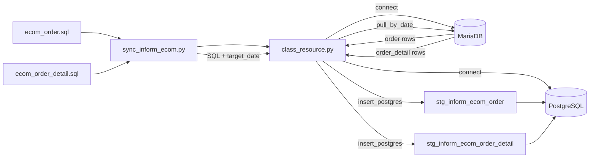

#  Sync Flow

## 1. Project Structure

```text
├── code/
│   ├── helper/   
│   │   └── class_resource.py
│   └── sync_inform_order.py
│
├── docs/
│   └── order_etl_flow.md
│
├── sql/
│
├── .gitignore
├── readme.md

    # Database credentials
```


## 2. Class Resource Logic

`class_resource.py` is the shared resource layer between the sync script and databases.

```text
                 class_resource.py
                         │
              ┌──────────┴──────────┐
              │                     │
              ▼                     ▼
           MariaDB              PostgreSQL
          (Source)              (Staging)
              │                     ▲
              │                     │
              └── pull_by_date() ───┤
                                    │
                             insert_postgres()
```

### Main Responsibilities

**`connect()`**

Creates database connections once at the beginning of the sync process.

```text
.env
  │
  ├── MariaDB
  │
  └── PostgreSQL
```

**`pull_by_date(sql, target_date)`**

Receives SQL from the orchestration layer and executes it against MariaDB using `target_date` as a parameter.

```text
SQL file
   +
target_date
   │
   ▼
pull_by_date()
   │
   ▼
MariaDB
   │
   ▼
List of rows
```

**`insert_postgres(rows, schema, table)`**

Receives extracted rows and inserts them into the PostgreSQL RAW staging table.

RAW staging uses an **append-only** strategy:

- Existing records are not updated.
- Existing records are not deleted.
- Duplicate source `id` values are allowed.
- Every sync inserts a new copy of the extracted source record.
- `loaded_at` records when the row was loaded into PostgreSQL.

**`close()`**

Closes both MariaDB and PostgreSQL connections after all sync jobs have completed.

---

## 3. Main Sync Flow

`sync_inform_ecom.py` controls the execution order.

```text
sync_order.py
   │
   ▼
Resource()
   │
   ▼
connect()
   │                            
   ▼                             
Read sql              
   │                            
   ▼                            
pull_by_date()             
   │                       
   ▼                            
MariaDB         
   │                         
   ▼                           
insert_postgres()            
   │                           
   ▼                            
Table stg_order    
   │
   ▼
close()

```

## 4. Data Flow



## 5. Design Principle

The responsibilities are separated into three layers:

```text
SQL Layer
   │
   │ Defines WHAT data to extract
   ▼
sql/*.sql

Resource Layer
   │
   │ Defines HOW to connect, pull and insert
   ▼
code/helper/class_resource.py

Orchestration Layer
   │
   │ Defines WHEN and IN WHAT ORDER jobs run
   ▼
code/sync_inform_ecom.py
```


### Core Rule

> `sync_inform_ecom.py` orchestrates the job.  
> `sql/` defines the extraction logic.  
> `class_resource.py` handles database resources and reusable database operations.  
> RAW staging tables remain append-only.